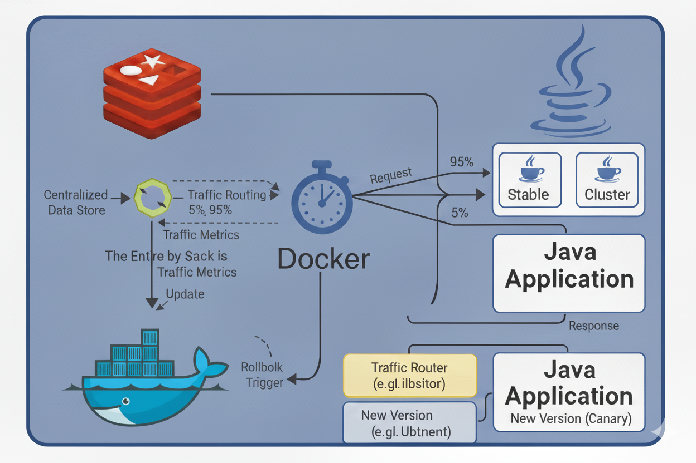

# Rate Limiter with Spring Boot, Redis and NGINX with (Canary Deployment)



This project implements a distributed rate limiting system for REST APIs using Spring Boot, Redis, and NGINX. The goal is to limit the number of requests a client can make within a configurable time window, even when the application is horizontally scaled.

## Features

- Limits the number of requests per IP in a configurable time window.
- Uses Redis to store request counters.
- Returns HTTP 429 (Too Many Requests) when the limit is exceeded.
- Automated tests with MockMvc.

## Canary Deployment

**Canary Deployment** is a technique that allows you to release a new version of your application (the "canary") to a small subset of users alongside the stable version. This helps you test new features in production with minimal risk. If the canary version works as expected, you can gradually shift more traffic to it and eventually promote it to stable.

### How this project implements Canary Deployment

- The `docker-compose.yml` file defines two Spring Boot application services: `server-app-stable` and `server-app-canary`.
- Both services use the same codebase and Dockerfile, but you can configure the canary instance differently (e.g., with different environment variables or code changes).
- NGINX acts as a load balancer, distributing incoming requests between the stable and canary instances. You can adjust the NGINX configuration to control the traffic split (e.g., 90% stable, 10% canary).
- Both instances share the same Redis backend for rate limiting, ensuring consistent behavior.

### How to observe/test Canary Deployment

- By default, NGINX load balances requests between the stable and canary instances. You can check the logs of each instance to see which one handled your request:
  - `docker-compose logs server-app-stable`
  - `docker-compose logs server-app-canary`
- To change the traffic split, edit the `nginx.conf` file and adjust the `upstream` weights.
- You can deploy a new version to the canary instance by changing its build context, environment variables, or code, then rebuilding and restarting only the canary service.

## Project Structure

- `src/main/java/com/meurer/rate/limiter/redis/nginx/canary/`: Main application code.
- `src/main/java/com/meurer/rate/limiter/redis/nginx/canary/config/`: Rate limiter configurations.
- `src/main/java/com/meurer/rate/limiter/redis/nginx/canary/controller/`: Test controller.
- `src/test/java/com/meurer/rate/limiter/redis/nginx/canary/`: Automated tests.
- `docker-compose.yml`: Defines Redis, multiple Spring Boot instances, and NGINX load balancer.
- `Dockerfile`: Used to build the Spring Boot application image.
- `nginx.conf`: NGINX load balancer configuration.
- `target/`: Contains the built JAR after running Maven.
- `docs/`: Documentation and diagrams.

## Prerequisites

- Java 21+
- Maven
- Docker & Docker Compose

## Environment Variables

You can configure the application using environment variables or by editing `src/main/resources/application.properties`:

- `SPRING_REDIS_HOST` (default: `redis`)
- `SPRING_REDIS_PORT` (default: `6379`)
- `RATE_LIMITER_LIMIT` (default: `10`)
- `RATE_LIMITER_WINDOW` (default: `60`)

## How to Run

1. **Build the application JAR**

   ```sh
   mvn clean package
   ```
   Output: `target/canary-0.0.1-SNAPSHOT.jar`

2. **Start the stack with Docker Compose**

   ```sh
   docker-compose up --build -d
   ```
   **Services:**
   - Redis
   - Two Spring Boot app instances (canary and stable)
   - NGINX (port 80)

3. **Access the API**

   - Endpoint: `http://localhost/test`
   - NGINX load balances between app instances.

4. **Run automated tests**

   ```sh
   mvn test
   ```

## Useful Commands

- Build the JAR: `mvn clean package`
- Start all services: `docker-compose up --build -d`
- Stop all services: `docker-compose down`
- View logs: `docker-compose logs -f`
- Rebuild without cache: `docker-compose build --no-cache`
- Run tests: `mvn test`

## Troubleshooting

- Ensure `target/canary-0.0.1-SNAPSHOT.jar` exists before building Docker images.
- Build from the project root so Docker can access the `target/` directory.
- Use `docker-compose build --no-cache` to avoid cache issues.
- If you have permission issues on WSL, use `sudo`.

## Architecture Overview

Docker Compose orchestrates:

- **Redis**: Stores request counters per IP.
- **Spring Boot Apps**: Identical instances, each using Redis for rate limiting.
- **NGINX**: Load balancer, distributes requests.

### Flow Diagram

```
Client → NGINX (port 80) → app-stable/app-canary (port 8080) → Redis (port 6379)
```

## Running with Docker on WSL (Windows Subsystem for Linux)

1. Open your WSL terminal (e.g., Ubuntu).
2. Navigate to your project directory:
   ```sh
   cd /mnt/d/Desenvolvimento/java/rate-limiter-redis-nginx-canary
   ```
3. Ensure Docker Desktop is running on Windows.
4. Run:
   ```sh
   docker-compose up --build -d
   ```
5. If needed, use `sudo` for permissions:
   ```sh
   sudo docker-compose up --build -d
   ```

---

All documentation is centralized in this `README.md` file.
